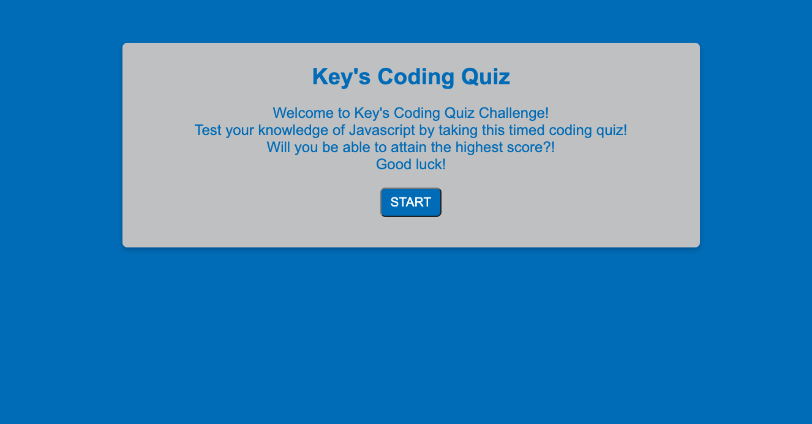

# WebAPICodeQuiz
This is a code quiz made from HTML/CSS. It is the Week 4 Challenge for my Coding Bootcamp

Project Description: The goal of this project was to create a coding quiz application. Using the provided the CSS, HTML and starter Javascript code, I was able to create a coding quiz that met the following criteria:

    * When a user clicks the start button, they are presented with a question
    * When the quiz begins and presents the first question, a timer begins
    * When the user answers a question wrong, time is subtracted from the clock
    * When the timer reaches 0, the game is over
    *When the game is over, user can save their initials and score

Authors
*Keiquan Blackmon

Screenshot

Repo:
https://yepitskeys.github.io/PasswordGenerator/

